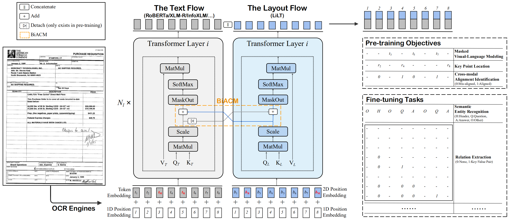

# LiLT - PyTorch
 


My Implementation of [LiLT: A Simple yet Effective Language-Independent Layout Transformer](https://aclanthology.org/2022.acl-long.534.pdf),for Structured Document Understanding

LiLT can be pre-trained on the structured documents of a single language and then directly fine-tuned on other languages with the corresponding off-the-shelf
monolingual/multilingual pre-trained textual models. Experimental results on eight languages have shown that LiLT can achieve competitive or even superior performance on diverse widely-used downstream benchmarks, which enables language-independent benefit from the pre-training of document layout structure

## Demo

An interactive demo for the same can be found out [here]([https://huggingface.co/spaces/iakarshu/latr-vqa](https://huggingface.co/spaces/iakarshu/lilt))

## Install

```python
pip install transformers
pip install sentencepiece==0.1.91
pip install pytesseract
sudo apt install tesseract-ocr
pip install 'Pillow==7.1.2'
```

## Usage

* The training of LiLT from scratch with PyTorch Lightening can be referred [here](https://github.com/uakarsh/LiLT/tree/main/notebooks)

## Results:

Currently, I used the following configurations:

```python
config = {
  "hidden_dropout_prob": 0.1,
  "hidden_size_t": 768,
  "hidden_size" : 768,
  "hidden_size_l": 768 // 6,
  "intermediate_ff_size_factor": 4,
  "max_2d_position_embeddings": 1001,
  "max_seq_len_l": 512,
  "max_seq_len_t" : 512,
  "num_attention_heads": 12,
  "num_hidden_layers": 12,
  'dim_head' : 64,
  "shape_size": 96,
  "vocab_size": 50265,
  "eps": 1e-12,
  "fine_tune" : True
}
```

* The results of all the experiments can be found out [here]([https://wandb.ai/iakarshu/VQA%20with%20LaTr?workspace=](https://wandb.ai/iakarshu/RVL%20CDIP%20with%20LiLT?workspace=user-iakarshu))

The same weights can be downloaded by the command as follows:
```
pip install gdown
gdown 1eRV4fS_LFwI5MHqcRwLUNQZgewxI6Se_
```

* The script of the same can be found out [here]([https://www.kaggle.com/code/akarshu121/latr-textvqa-training-with-wandb](https://www.kaggle.com/code/akarshu121/lilt-4-lilt-for-specific-purpose-rvl-cdip))

##  License

MIT

## Maintainers

- [uakarsh](https://github.com/uakarsh)

## Contribute


## Citations

```bibtex

```

